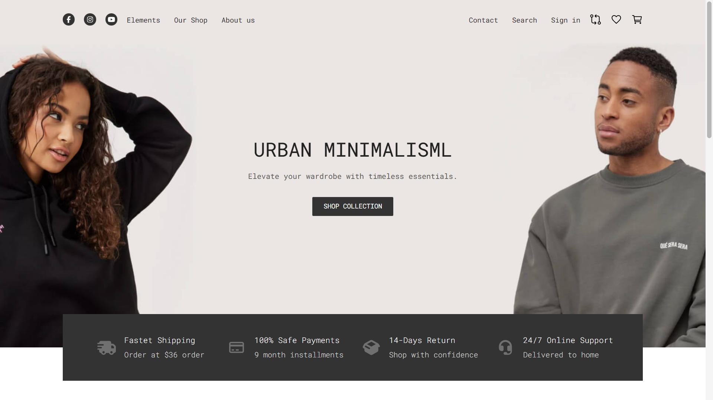
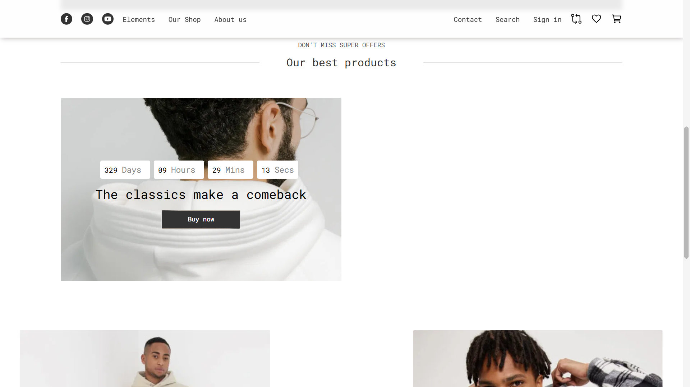

# 🛍️ E‑Commerce

An **E-Commerce** project was built using
**Vite + JavaScript + SCSS**, 
aiming to simulate the basic functionalities of an e-commerce website.

------------------------------------------------------------------------

## 🚀 Demo






------------------------------------------------------------------------

## 🧠 Objectives

-   Front-End Practice with Vite
-   Building UI/UX for an e-commerce website
-   Getting familiar with the real-world project structure

------------------------------------------------------------------------

## 📦 Technologies

-   Vite
-   JavaScript (ES6+)
-   HTML5 / CSS3
-   SCSS

------------------------------------------------------------------------

## 📁 Directory structure

    src/
     ├─ assets/
     ├─ components/
     └─ demo/
     ├─ main.js
     └─ App.js

------------------------------------------------------------------------

## 🛠️ Install & run

``` bash
git clone https://github.com/PeaIsPea/e-commerce.git
cd e-commerce
npm install
npm run dev
```

------------------------------------------------------------------------

## 🔍 Features

-   Display product list -> 
-   Clean display
-   The code structure is clear and easy to extend.

------------------------------------------------------------------------

## 📌 Development orientation

-   API connection
-   Cart & Payment
-   Sign Up / Sign In

------------------------------------------------------------------------

## 👤 Author

**PeaIsPea**\
GitHub: https://github.com/PeaIsPea

------------------------------------------------------------------------